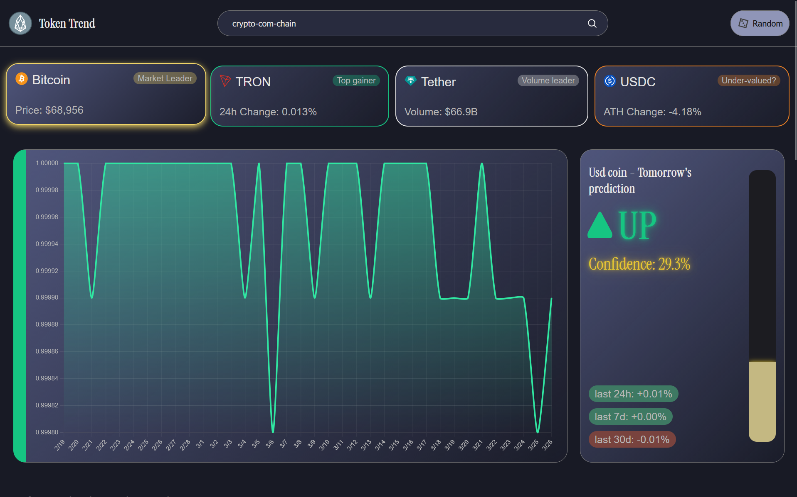
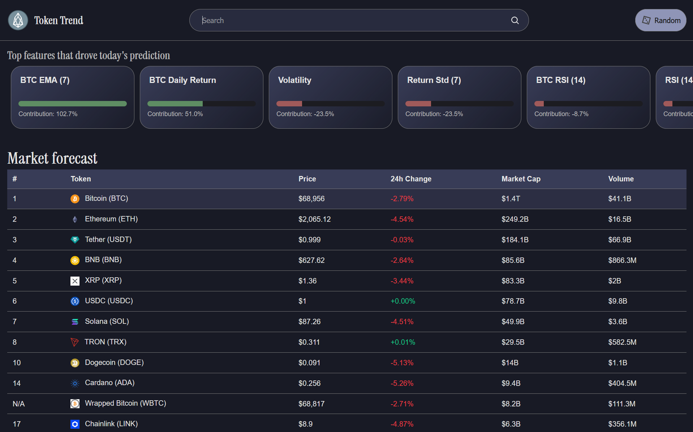

# group-7

## Team Members
- Aarushi Ghosh-https://github.com/aarushi0618
- Gaurav Murugesan - https://github.com/gaurav-murugesan
- Piyush Daga - https://github.com/dev-piyush27
- Darla Navadeep - [Spectrallrepos](https://github.com/Spectrallrepos)
- Nishant Jat -

## Project links
- PPT link: [ppt]
- Hosted demo: [TokenTrend](https://tokentrendmu.vercel.app/)

---
# Technical Implementation
## ML Engine & Technical Implementation
The backbone of TokenTrend is a universal predictive engine trained on 23 distinct crypto assets. Instead of a "one-size-fits-all" model, we built a pipeline that treats the market as a high-dimensional time-series problem.

### 1. Feature Engineering (The "Alpha")
We transformed raw price/volume into 30+ predictive signals using a custom add_enhanced_features pipeline:

**Trend & Momentum: MACD (Signal/Hist), RSI, and EMA crossovers.**
**Volatility/Risk: ATR (14-day) and Bollinger Band width to scale predictions against market noise.**
**Statistical Edge: Included Return Skewness and Kurtosis to model "fat-tail" risks (sudden pumps/dumps).**
**Market Correlation: Integrated Bitcoin Lags (BTC Price/RSI) to capture the "leader-follower" dynamic in altcoins.**

### 2. The Model Tournament
We ran a competitive evaluation using TimeSeriesSplit (3-fold) to avoid data leakage. We compared four architectures:

**Logistic Regression: Weighted baseline for class balance.**
**Random Forest: For capturing non-linear interactions.**
**Gradient Boosting: Optimized via RandomizedSearchCV.**
**Stacking Ensemble: A multi-layered model combining the trees with a meta-learner.**

### 3. Training Logic & Metrics
**Validation: 80/20 Chronological split to maintain temporal integrity.**
**Normalization: Applied StandardScaler to ensure price parity across different market caps.**
**Optimization: We prioritized F1-Score (0.6533) over simple Accuracy. In trading, balancing Precision (avoiding fake signals) and Recall (catching the move) is the only way to remain profitable.**

### 4. Deployment (data.json)
The learned "intelligence" is compressed into a 100% portable data.json. This contains scaling parameters, feature importances, and model weights, allowing the frontend to run instant inference without a live Python backend.

---

## Mathematical Model & Prediction Engine
The prediction math for the dashboard executes entirely at the edge. Instead of relying on a slow Python backend, the application loads a pre-trained weight matrix and calculates the inference instantly within the client's browser for zero-latency forecasting.

### 1. Edge-Based Logistic Regression
We deployed a multivariate classification algorithm optimized for client-side execution without compromising mathematical rigor:

**Serverless Inference:** The core prediction engine runs entirely within the JavaScript environment, completely eliminating traditional server latency, network routing delays, and backend API bottlenecks.
**Static Weight Mapping:** By reading directly from the compiled data.json file, the algorithm continuously applies historical training weights to live, standardized data streams instantaneously.

### 2. Sigmoid Probability Compression
To translate raw mathematical output into a user-friendly metric, the engine utilizes a strict mathematical activation function:

**Unbounded to Bounded:** The system processes the final weighted sums (Z-scores) through a Sigmoid curve to compress the extreme numerical variances found in financial data.
**Definitive Percentages:** This mathematical compression guarantees that the abstract logistic scores are squashed into a strict, readable probability metric that is definitively bounded between 0% and 100%.

### 3. Scientific Decision Boundary
We prioritized statistical honesty over visual appeal when designing the user interface and the underlying confidence meter:

**Unmanipulated Threshold:** The dashboard employs a mathematically neutral 50% decision boundary to definitively classify an asset's projected trajectory as either upward or downward.
**Statistical Integrity:** By refusing to artificially scale, pad, or shift this threshold to make the model appear more confident, the UI reflects the exact, unvarnished mathematical reality of the algorithm.

### 4. Volatility Optimization
Cryptocurrency markets are notoriously noisy and volatile, requiring a model tuned specifically to handle asymmetrical financial risk:

**F1-Score Calibration:** The underlying algorithm was explicitly optimized to achieve an F1-Score of 0.6533, deliberately prioritizing this balance over raw, often misleading baseline accuracy metrics.
**Precision vs. Recall:** This rigorous calibration ensures the system is sensitive enough to capture early-stage upward momentum, while remaining mathematically strict enough to avoid overwhelming the user with false positive signals.

---
## TokenTrend: Interactive Dashboard and Inference

### What the Dashboard Does
- Shows a live market table for a curated set of tokens.
- Lets users select tokens by table click, search, or random pick.
- Displays a directional prediction card (UP or DOWN) with confidence intensity.
- Breaks down the top feature contributions behind the current prediction.
- Highlights quick market snapshots through top-token cards
### Interactive Dashboard Features
- Clickable market rows and top cards that trigger full prediction + chart refresh.
- Random token button for fast exploration.
- Dynamic color states

## Technical Inferences
- Inference is run directly in the browser using model parameters loaded from data.json.
- Feature vectors are built from recent OHLC market history and Bitcoin context signals in predict.js.
- Raw feature values are normalized with saved scaling parameters, then combined into a linear score and transformed into probability.
- Probability is remapped around a model threshold into a user-friendly confidence scale.
- Feature contribution values are exposed to the UI and ranked to show the strongest drivers of each prediction.
### Data Sources and API Usage
- CoinGecko:
  Used for market list data (price, cap, volume, 24h change, rank).
- CryptoCompare:
  Used for OHLC history for trend charting and feature generation.
### Caching strategy:
- Market and OHLC responses are cached in localStorage with short TTL windows of 5min to reduce API calls and improve responsiveness.

---
# Screenshots

